# Gemini & Claude AI Integration for Databricks

[](https://www.python.org/downloads/)
[](https://opensource.org/licenses/MIT)
[](https://databricks.com/)
[](https://github.com/gustcol/gemini-claude-databricks)

A comprehensive Python library that enables seamless integration of **Google's Gemini** and **Anthropic's Claude** AI models within Databricks notebooks and jobs. This library simplifies AI-assisted development workflows directly in your Databricks environment.

**Repository:** [https://github.com/gustcol/gemini-claude-databricks](https://github.com/gustcol/gemini-claude-databricks)

---

## Table of Contents

- [Overview](#overview)
- [Architecture](#architecture)
- [Features](#features)
- [Installation](#installation)
- [Quick Start](#quick-start)
- [Configuration](#configuration)
- [Core Components](#core-components)
- [Usage Examples](#usage-examples)
- [Spark Integration](#spark-integration)
- [API Reference](#api-reference)
- [Semantic Cache](#semantic-cache)
- [RAG (Retrieval Augmented Generation)](#rag-retrieval-augmented-generation)
- [AI Agents](#ai-agents)
- [MLflow Tracking](#mlflow-tracking)
- [Prompt Templates](#prompt-templates)
- [Data Quality](#data-quality)
- [Magic Commands](#magic-commands)
- [Documentation Generator](#documentation-generator)
- [dbt Integration](#dbt-integration)
- [Security Guardrails](#security-guardrails)
- [Security Best Practices](#security-best-practices)
- [Troubleshooting](#troubleshooting)
- [Pipeline Generation](#pipeline-generation)
- [Unity Catalog Integration](#unity-catalog-integration)
- [Contributing](#contributing)
- [License](#license)

---

## Overview

This library provides a unified interface to interact with multiple AI providers (Google Gemini and Anthropic Claude) within Databricks, enabling developers to:

- Generate code automatically for Spark/PySpark tasks
- Analyze DataFrames with AI-powered insights
- Optimize SQL queries with intelligent suggestions
- Debug errors with contextual explanations
- Process data at scale using AI-powered Spark UDFs

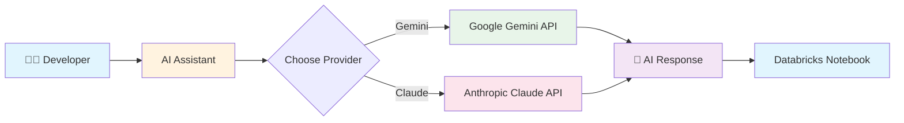

---

## Architecture

### High-Level Architecture

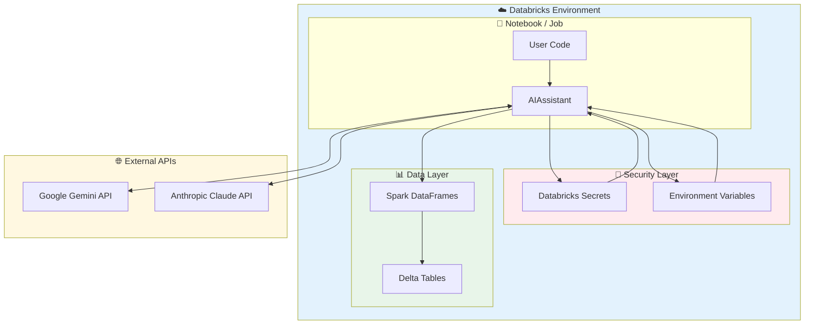

### Component Architecture

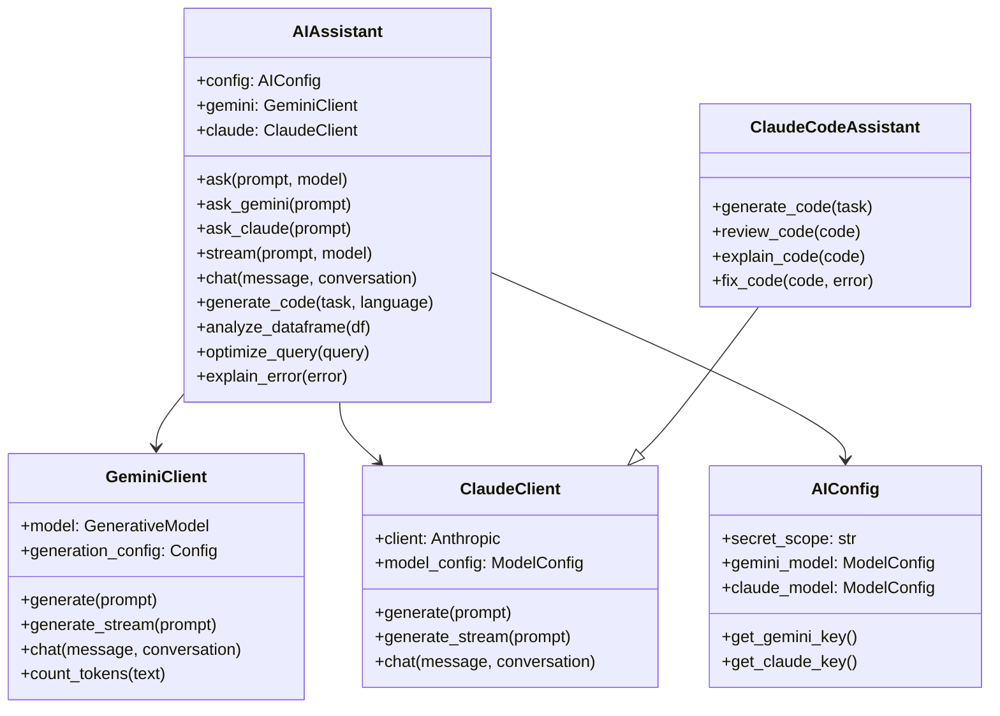

### Request Flow

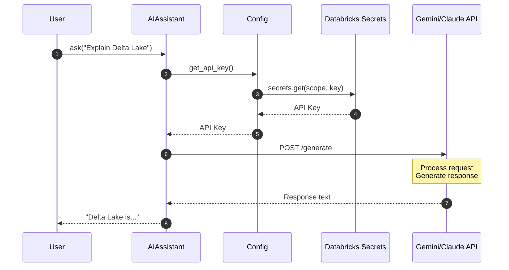

---

## Features

### Feature Overview

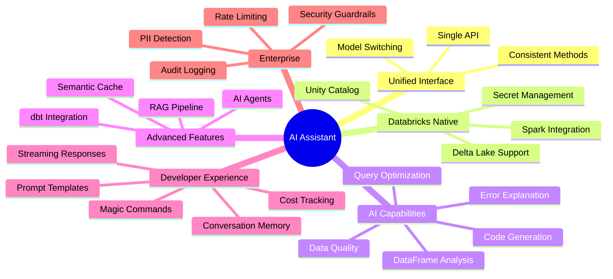

### Detailed Features

| Feature | Description | Gemini | Claude |
|---------|-------------|:------:|:------:|
| **Text Generation** | Generate responses to prompts | ✅ | ✅ |
| **Streaming** | Real-time response streaming | ✅ | ✅ |
| **Conversations** | Multi-turn chat with memory | ✅ | ✅ |
| **Code Generation** | Generate code for specific tasks | ✅ | ✅ |
| **Code Review** | Review and improve code | ✅ | ✅ |
| **Code Explanation** | Explain complex code | ✅ | ✅ |
| **Error Analysis** | Debug errors with context | ✅ | ✅ |
| **DataFrame Analysis** | AI-powered data insights | ✅ | ✅ |
| **Query Optimization** | SQL optimization suggestions | ✅ | ✅ |
| **Batch Processing** | Process data at scale with UDFs | ✅ | ✅ |
| **Cost Tracking** | Monitor token usage and costs | ✅ | ✅ |
| **Semantic Cache** | Cache responses by semantic similarity | ✅ | ✅ |
| **RAG Pipeline** | Document-augmented generation | ✅ | ✅ |
| **AI Agents** | Autonomous task completion | ✅ | ✅ |
| **MLflow Tracking** | Experiment tracking & A/B tests | ✅ | ✅ |
| **Prompt Templates** | Reusable, versioned prompts | ✅ | ✅ |
| **Data Quality** | DLT/GE expectation generation | ✅ | ✅ |
| **Magic Commands** | IPython notebook shortcuts | ✅ | ✅ |
| **Docs Generator** | Auto documentation generation | ✅ | ✅ |
| **dbt Integration** | DLT ↔ dbt conversion | ✅ | ✅ |
| **Security Guardrails** | SQL/PII validation, rate limiting | ✅ | ✅ |

---

## Installation

### Installation Flow

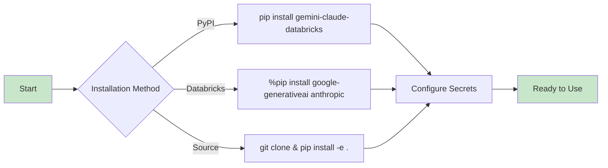

### Option 1: Install from PyPI (when published)
```python
%pip install gemini-claude-databricks
```

### Option 2: Install directly in Databricks notebook
```python
%pip install google-generativeai anthropic

# Copy the ai_assistant module to your workspace or DBFS
```

### Option 3: Clone and install locally
```bash
git clone https://github.com/gustcol/gemini-claude-databricks.git
cd gemini-claude-databricks
pip install -e .
```

### Dependencies

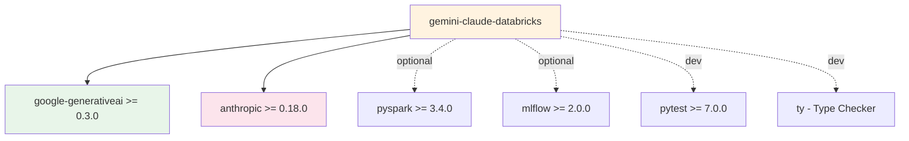

### Development Setup

```bash
# Install development dependencies
pip install -e ".[dev]"

# Run type checking with ty (Astral's type checker)
pip install ty
ty check ai_assistant/

# Run tests
pytest tests/ -v
```

> **Note**: Type checking with `ty` will show errors for optional dependencies (`google.generativeai`, `anthropic`, `mlflow`, `IPython`) when they are not installed. These are expected and can be safely ignored.

---

## Quick Start

### Setup Process

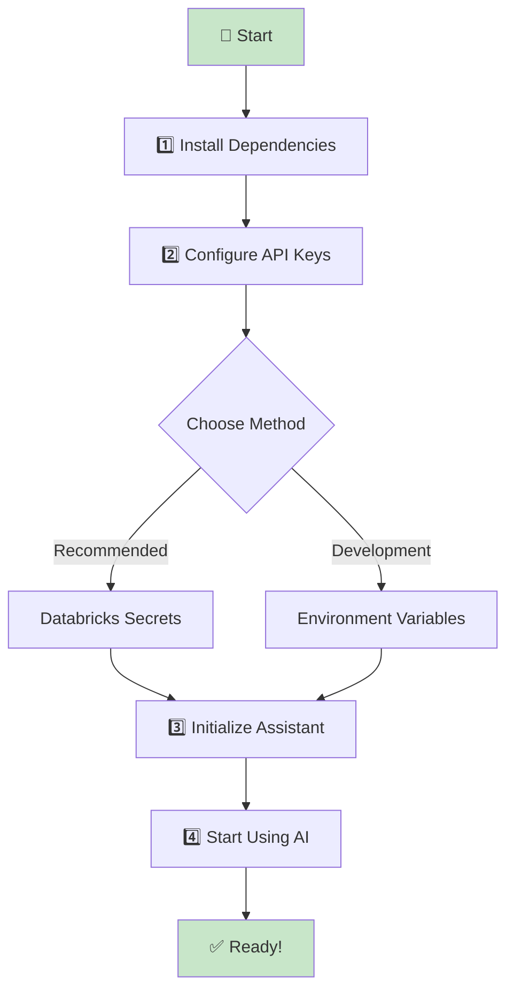

### Step 1: Configure Secrets in Databricks

```bash
# Using Databricks CLI
databricks secrets create-scope --scope ai-keys

# Add your API keys
databricks secrets put --scope ai-keys --key gemini-api-key
databricks secrets put --scope ai-keys --key claude-api-key
```

### Step 2: Initialize and Use

```python
from ai_assistant import AIAssistant

# Initialize with Databricks secret scope
assistant = AIAssistant(
    secret_scope="ai-keys",
    gemini_secret_key="gemini-api-key",
    claude_secret_key="claude-api-key"
)

# Use Gemini
response = assistant.ask_gemini("Explain PySpark DataFrame operations")
print(response)

# Use Claude
response = assistant.ask_claude("Write a function to optimize Spark queries")
print(response)

# Use default model (Claude)
response = assistant.ask("What is Delta Lake?")
print(response)
```

---

## Configuration

### Configuration Hierarchy

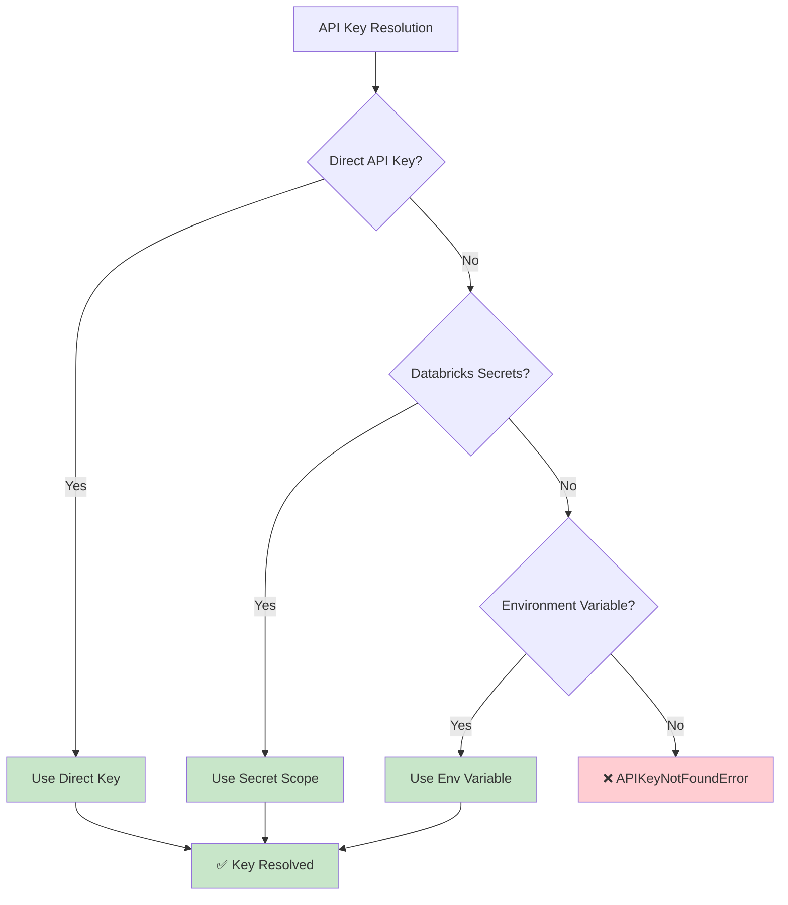

### Configuration Options

```python
from ai_assistant import AIAssistant

assistant = AIAssistant(
    # Secret Management
    secret_scope="ai-keys",           # Databricks secret scope name
    gemini_secret_key="gemini-key",   # Key name in secret scope
    claude_secret_key="claude-key",   # Key name in secret scope

    # Model Selection
    gemini_model="gemini-1.5-pro",    # Gemini model to use
    claude_model="claude-sonnet-4-20250514",  # Claude model to use

    # Generation Parameters
    max_tokens=4096,                  # Maximum output tokens
    temperature=0.7,                  # Creativity (0.0 - 1.0)
)
```

### Environment Variables (Alternative)

```python
import os
os.environ["GEMINI_API_KEY"] = "your-gemini-key"
os.environ["ANTHROPIC_API_KEY"] = "your-claude-key"

assistant = AIAssistant()  # Auto-detects from environment
```

### Supported Models

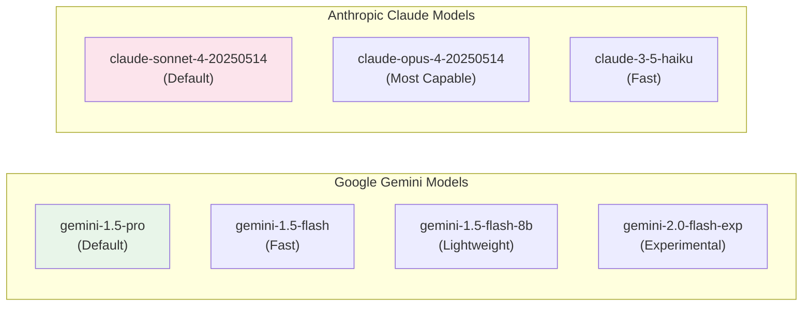

---

## Core Components

### Module Structure

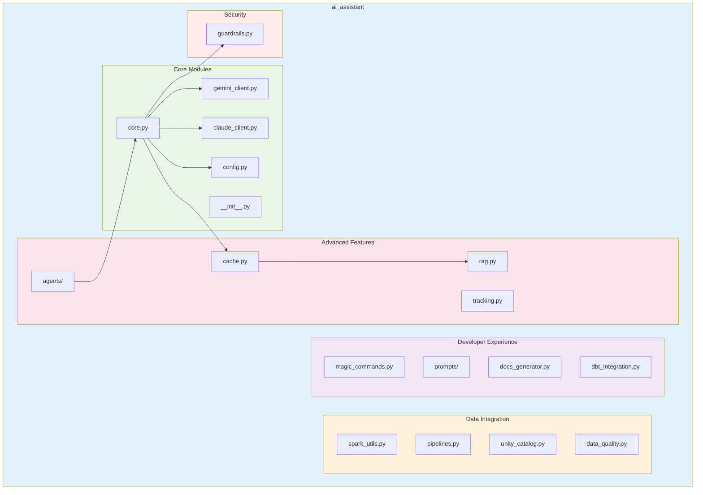

### Class Relationships

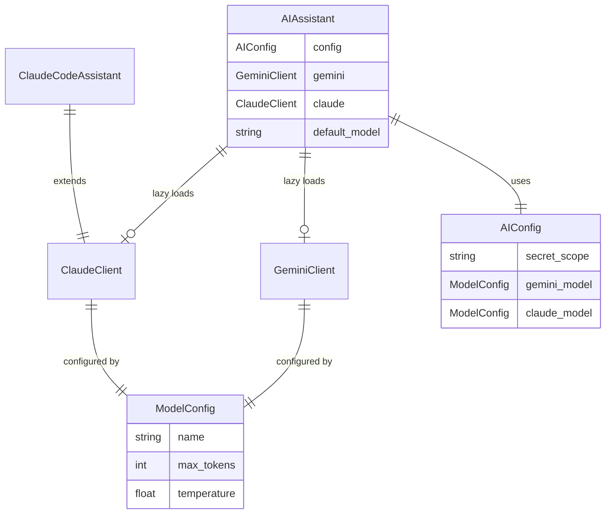

---

## Usage Examples

### Basic Conversation Flow

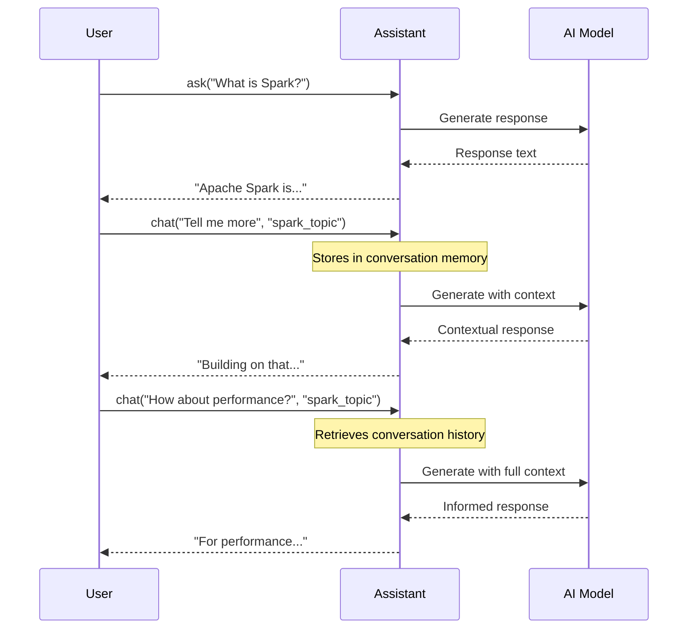

### Code Generation Example

```python
# Generate PySpark code
code = assistant.generate_code(
    task="Create a function that reads a Delta table and performs aggregations",
    language="python",
    context="Using Databricks with Unity Catalog",
    include_tests=True
)
print(code)
```

### DataFrame Analysis

```python
# Load a DataFrame
df = spark.read.table("sales.transactions")

# Get AI-powered analysis
analysis = assistant.analyze_dataframe(
    df,
    questions=[
        "What are the data quality issues?",
        "Suggest optimization strategies",
        "Recommend partitioning scheme"
    ]
)
print(analysis)
```

### Query Optimization

```python
slow_query = """
SELECT customer_id, SUM(amount) as total
FROM orders
JOIN customers ON orders.customer_id = customers.id
WHERE order_date >= '2024-01-01'
GROUP BY customer_id
"""

optimized = assistant.optimize_query(
    query=slow_query,
    context="orders: 500M rows, customers: 10M rows"
)
print(optimized)
```

### Error Debugging

```python
error_message = """
AnalysisException: Table or view not found: sales.transactions
"""

explanation = assistant.explain_error(
    error_message=error_message,
    code="df = spark.read.table('sales.transactions')"
)
print(explanation)
```

---

## Spark Integration

### Batch Processing Architecture

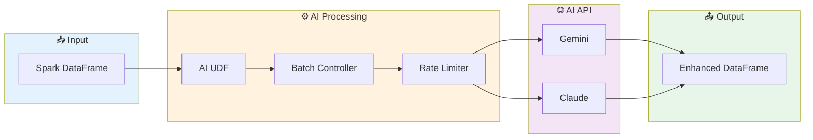

### Process DataFrame with AI

```python
from ai_assistant.spark_utils import process_with_ai

# Process text column with AI
results_df = process_with_ai(
    spark_df=input_df,
    prompt_column="product_description",
    model="gemini",
    output_column="ai_analysis",
    batch_size=10,
    rate_limit_delay=0.5,
    system_instruction="Analyze sentiment and extract key features"
)

results_df.show()
```

### Create Custom AI UDF

```python
from ai_assistant.spark_utils import create_ai_udf
from pyspark.sql.functions import col

# Create a sentiment analysis UDF
sentiment_udf = create_ai_udf(
    model="claude",
    api_key=api_key,
    system_instruction="Classify sentiment as: positive, negative, or neutral",
    max_tokens=50
)

# Apply to DataFrame
df_with_sentiment = df.withColumn(
    "sentiment",
    sentiment_udf(col("review_text"))
)
```

### Cost Estimation

```python
from ai_assistant.spark_utils import estimate_processing_cost

# Estimate before processing
estimate = estimate_processing_cost(
    row_count=100000,
    avg_input_tokens=150,
    avg_output_tokens=100,
    model="gemini-1.5-flash"
)

print(f"Estimated cost: ${estimate['total_cost']:.2f}")
print(f"Total tokens: {estimate['total_input_tokens'] + estimate['total_output_tokens']:,}")
```

---

## API Reference

### Core Methods

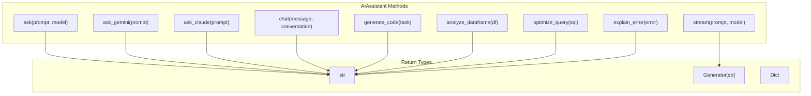

### Method Signatures

| Method | Parameters | Returns | Description |
|--------|------------|---------|-------------|
| `ask()` | `prompt: str, model: str = None` | `str` | Ask any model |
| `ask_gemini()` | `prompt: str, system_instruction: str = None` | `str` | Ask Gemini |
| `ask_claude()` | `prompt: str, system_instruction: str = None` | `str` | Ask Claude |
| `stream()` | `prompt: str, model: str = None` | `Generator` | Stream response |
| `chat()` | `message: str, conversation_name: str` | `str` | Multi-turn chat |
| `generate_code()` | `task: str, language: str = "python"` | `str` | Generate code |
| `analyze_dataframe()` | `df: DataFrame, questions: List[str]` | `str` | Analyze data |
| `optimize_query()` | `query: str, context: str = None` | `str` | Optimize SQL |
| `explain_error()` | `error_message: str, code: str = None` | `str` | Debug errors |

See [API Documentation](docs/api.md) for complete reference.

---

## Semantic Cache

Reduce costs and latency by caching AI responses based on semantic similarity.

### Cache Architecture

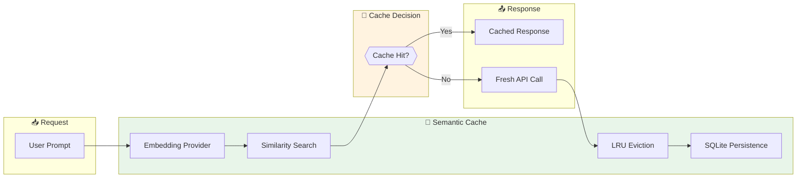

### Using the Cache

```python
from ai_assistant import create_cache, CachedAIClient, AIAssistant

assistant = AIAssistant(secret_scope="ai-keys")

# Create a semantic cache
cache = create_cache(
    backend_type="memory",       # or "sqlite" for persistence
    max_size=1000,               # Maximum cached entries
    similarity_threshold=0.95,   # Semantic similarity threshold
    ttl_seconds=3600,            # Cache TTL (1 hour)
    db_path="/dbfs/cache/ai_cache.db"  # For sqlite backend
)

# Wrap your AI client with caching
cached_gemini = CachedAIClient(
    client=assistant.gemini,
    cache=cache
)

# First call - hits API
response1 = cached_gemini.generate("What is Apache Spark?")

# Similar prompt - uses cache (faster, no cost)
response2 = cached_gemini.generate("Explain Apache Spark")

# Get cache statistics
stats = cached_gemini.get_cache_stats()
print(f"Cache hits: {stats['hits']}, Misses: {stats['misses']}")
print(f"Hit rate: {stats['hit_rate']:.2%}")
```

### Cache Statistics

| Metric | Description |
|--------|-------------|
| `hits` | Number of cache hits |
| `misses` | Number of cache misses |
| `hit_rate` | Percentage of requests served from cache |
| `total_entries` | Current number of cached entries |
| `estimated_savings` | Estimated cost savings |

---

## RAG (Retrieval Augmented Generation)

Enhance AI responses with context from your documents and Unity Catalog metadata.

### RAG Architecture

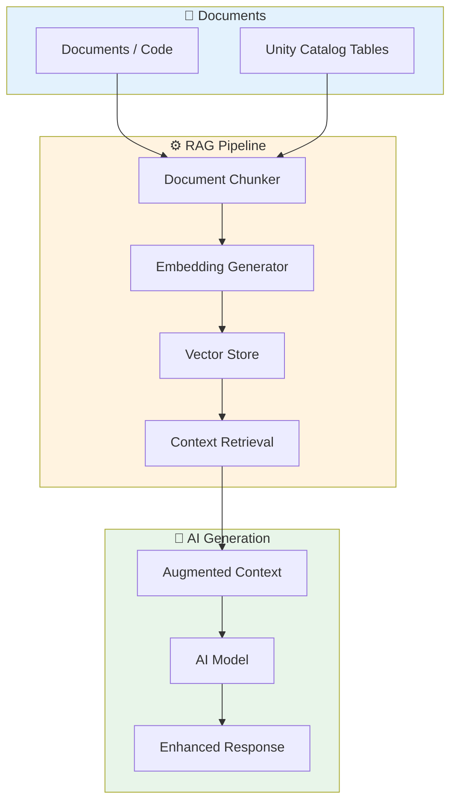

### Using RAG

```python
from ai_assistant import create_rag_pipeline, Document, AIAssistant

assistant = AIAssistant(secret_scope="ai-keys")

# Create RAG pipeline
rag = create_rag_pipeline(
    spark=spark,
    catalog="analytics",
    chunk_size=500,
    chunk_overlap=50
)

# Add documents
docs = [
    Document(id="delta_docs", content="Delta Lake documentation...", metadata={"source": "delta_docs.md"}),
    Document(id="spark_guide", content="Spark optimization guide...", metadata={"source": "spark_guide.md"}),
]
rag.add_documents(docs)

# Query with enhanced context (Unity Catalog context is built-in)
response = rag.query(
    "How do I optimize Delta Lake tables for my sales data?",
    ai_client=assistant.gemini,
    include_uc_context=True
)
print(response)
```

### Chunking Strategies

| Strategy | Best For | Description |
|----------|----------|-------------|
| `FIXED_SIZE` | General documents | Fixed character count chunks |
| `SENTENCE` | Prose text | Split on sentence boundaries |
| `PARAGRAPH` | Structured docs | Split on paragraph breaks |
| `SEMANTIC` | Technical docs | AI-driven semantic splitting |

---

## AI Agents

Autonomous agents that can analyze data, generate pipelines, and perform complex tasks.

### Agent Architecture

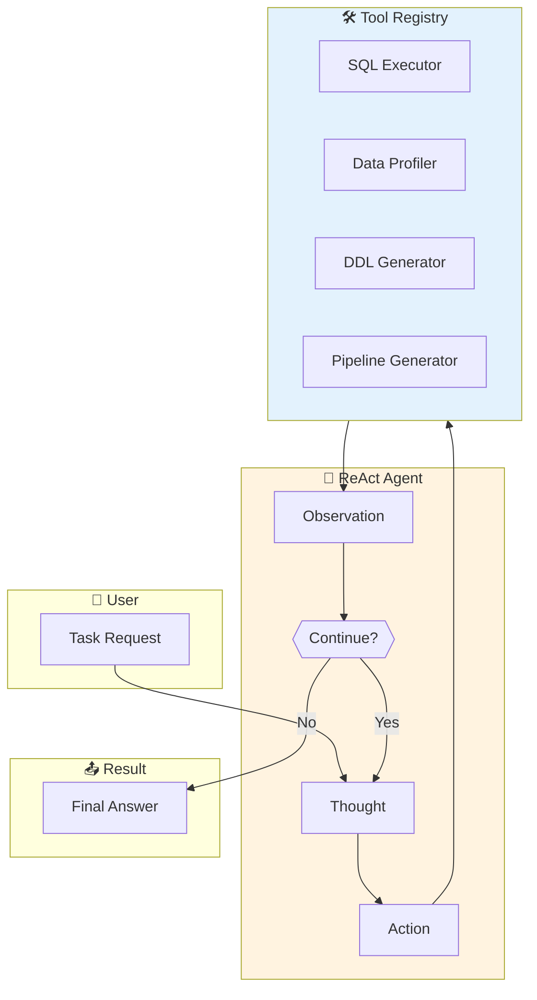

### Using Data Analyst Agent

```python
from ai_assistant import DataAnalystAgent, AIAssistant

assistant = AIAssistant(secret_scope="ai-keys")

# Create data analyst agent
analyst = DataAnalystAgent(
    ai_client=assistant.claude,
    spark=spark
)

# Analyze a table
analysis = analyst.analyze_table("analytics.sales.transactions")
print(analysis)

# Ask complex questions (agent uses tools automatically)
answer = analyst.answer_question(
    "What are the top 10 customers by revenue and how has their purchasing "
    "pattern changed over the last 6 months?"
)
print(answer)

# Profile data quality
profile = analyst.profile_data("analytics.sales.transactions")
print(profile)
```

### Using Data Engineer Agent

```python
from ai_assistant import DataEngineerAgent

# Create data engineer agent
engineer = DataEngineerAgent(
    ai_client=assistant.claude,
    spark=spark
)

# Generate table DDL
ddl = engineer.create_table(
    "Create a fact table for order transactions with customer, product, "
    "and time dimensions. Include partitioning and Z-ordering."
)
print(ddl)

# Generate DLT pipeline
pipeline = engineer.generate_pipeline(
    "Create a medallion architecture for processing IoT sensor data "
    "with data quality expectations."
)
print(pipeline)

# Optimize a query
optimized = engineer.optimize_query(
    "SELECT * FROM orders JOIN customers ON orders.customer_id = customers.id"
)
print(optimized)
```

### Available Tools

| Tool | Description | Agent |
|------|-------------|-------|
| `SQLExecutorTool` | Execute SQL queries | Both |
| `TableInfoTool` | Get table schema/metadata | Both |
| `DataProfilerTool` | Profile data quality | Analyst |
| `DDLGeneratorTool` | Generate CREATE statements | Engineer |
| `PipelineGeneratorTool` | Generate DLT/ETL pipelines | Engineer |
| `QueryOptimizerTool` | Optimize SQL queries | Engineer |

---

## MLflow Tracking

Track AI calls, measure performance, and run A/B experiments.

### Tracking Architecture

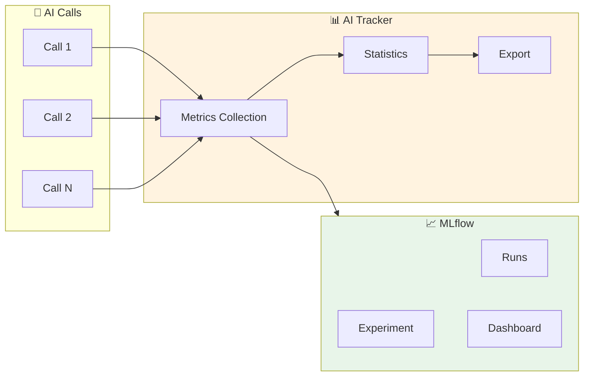

### Using Tracking

```python
from ai_assistant import create_tracker, TrackedAIClient, AIAssistant

assistant = AIAssistant(secret_scope="ai-keys")

# Create tracker with MLflow integration
tracker = create_tracker(
    experiment_name="ai_assistant_experiment",
    enable_mlflow=True
)

# Wrap client with tracking
tracked_client = TrackedAIClient(
    client=assistant.gemini,
    tracker=tracker,
    cost_per_1k_input=0.00125,
    cost_per_1k_output=0.005
)

# Use normally - all calls are tracked
response = tracked_client.generate("What is Delta Lake?")

# Get statistics
stats = tracker.get_stats()
print(f"Total calls: {stats['total_calls']}")
print(f"Total cost: ${stats['total_cost']:.4f}")
print(f"Avg latency: {stats['avg_latency_ms']:.2f}ms")

# Export call history
calls = tracker.export_calls()
```

### A/B Experiments

```python
from ai_assistant import ABExperiment

# Compare Gemini vs Claude
experiment = ABExperiment(
    name="gemini_vs_claude",
    client_a=assistant.gemini,
    client_b=assistant.claude,
    split_ratio=0.5
)

# Run experiment
for prompt in test_prompts:
    response = experiment.run(prompt)

# Get results
results = experiment.get_results()
print(f"Model A calls: {results['model_a_calls']}")
print(f"Model B calls: {results['model_b_calls']}")
print(f"Model A avg latency: {results['model_a_avg_latency']:.2f}ms")
print(f"Model B avg latency: {results['model_b_avg_latency']:.2f}ms")
```

---

## Prompt Templates

Reusable, versioned prompt templates for consistent AI interactions.

### Template System

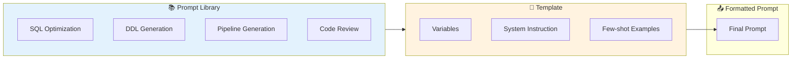

### Using Templates

```python
from ai_assistant import (
    PromptTemplate, PromptVariable, PromptLibrary,
    SQL_OPTIMIZATION_PROMPT, DDL_GENERATION_PROMPT,
    create_template, get_data_engineering_prompts
)

# Use built-in template
prompt = SQL_OPTIMIZATION_PROMPT.render(
    query="SELECT * FROM orders WHERE customer_id = 123",
    context="orders table has 500M rows, customer_id is not indexed"
)

# Generate with formatted prompt
response = assistant.ask(prompt)

# Get all data engineering prompts
all_prompts = get_data_engineering_prompts()

# Create custom template
my_template = PromptTemplate(
    name="data_analysis",
    description="Analyze data patterns",
    template="""
Analyze the following data from {table_name}:

Schema: {schema}
Sample: {sample_data}

Provide insights on:
1. Data quality issues
2. Patterns and trends
3. Recommendations
""",
    system_instruction="You are a data analysis expert.",
    variables=[
        PromptVariable(name="table_name", description="Table name", required=True),
        PromptVariable(name="schema", description="Table schema", required=True),
        PromptVariable(name="sample_data", description="Sample data", required=False, default="N/A"),
    ],
    version="1.0.0",
    tags=["analysis", "data-quality"]
)

# Use template with render method
prompt = my_template.render(
    table_name="sales.transactions",
    schema="id INT, amount DECIMAL, date DATE"
)
```

### Built-in Templates

| Template | Purpose | Variables |
|----------|---------|-----------|
| `SQL_OPTIMIZATION_PROMPT` | Optimize SQL queries | `query`, `context` |
| `DDL_GENERATION_PROMPT` | Generate CREATE statements | `description`, `requirements` |
| `PIPELINE_GENERATION_PROMPT` | Generate DLT/ETL pipelines | `description`, `source`, `target` |
| `ERROR_EXPLANATION_PROMPT` | Explain errors | `error_message`, `code` |
| `CODE_REVIEW_PROMPT` | Review code quality | `code`, `language` |
| `DATA_ANALYSIS_PROMPT` | Analyze datasets | `data`, `questions` |

---

## Data Quality

AI-powered data quality expectation generation for DLT and Great Expectations.

### Data Quality Flow

```mermaid
flowchart TB
    subgraph Input["📊 Input"]
        Schema["Table Schema"]
        Sample["Sample Data"]
    end

    subgraph Analyzer["🔍 Data Quality Analyzer"]
        AI["AI Analysis"]
        Patterns["Pattern Detection"]
        Rules["Rule Generation"]
    end

    subgraph Output["📤 Output"]
        DLT["DLT Expectations"]
        GE["Great Expectations"]
        Report["Quality Report"]
    end

    Schema --> AI
    Sample --> AI
    AI --> Patterns
    Patterns --> Rules
    Rules --> DLT
    Rules --> GE
    Rules --> Report

    style Analyzer fill:#fff3e0
    style Output fill:#e8f5e9
```

### Using Data Quality Analyzer

```python
from ai_assistant import create_data_quality_analyzer, AIAssistant

assistant = AIAssistant(secret_scope="ai-keys")

# Create analyzer
analyzer = create_data_quality_analyzer(
    ai_client=assistant.claude,
    spark=spark
)

# Analyze table and generate expectations
report = analyzer.analyze_table("analytics.sales.transactions")
print(f"Generated {len(report.expectations)} expectations")

# Generate DLT expectations code
dlt_code = analyzer.to_dlt_expectations(report.expectations)
print(dlt_code)
# Output:
# @dlt.expect_or_drop("valid_id", "id IS NOT NULL")
# @dlt.expect("valid_amount", "amount > 0")
# @dlt.expect("valid_email", "email RLIKE '^[a-zA-Z0-9_.+-]+@[a-zA-Z0-9-]+\\.[a-zA-Z0-9-.]+$'")

# Generate Great Expectations suite
ge_suite = analyzer.to_great_expectations(report.expectations)
print(ge_suite)
```

### Expectation Types

| Type | Description | Example |
|------|-------------|---------|
| `not_null` | Column cannot be null | `id IS NOT NULL` |
| `unique` | Values must be unique | `COUNT(DISTINCT id) = COUNT(*)` |
| `between` | Value in range | `amount BETWEEN 0 AND 1000000` |
| `regex_match` | Match pattern | `email RLIKE '^.*@.*$'` |
| `in_set` | Value in allowed set | `status IN ('active', 'inactive')` |
| `foreign_key` | Reference exists | `customer_id IN (SELECT id FROM customers)` |

---

## Magic Commands

IPython magic commands for quick AI interactions in notebooks.

### Available Commands

```mermaid
mindmap
  root((Magic Commands))
    %ai
      Quick questions
      Model selection
      Streaming
    %%ai_cell
      Multi-line prompts
      System instructions
    %ai_explain
      Code explanation
      Detail levels
    %%ai_optimize
      SQL optimization
    %%ai_generate
      Code generation
      Include tests
    %ai_fix
      Error debugging
```

### Using Magic Commands

```python
# Load the extension
%load_ext ai_assistant.magic_commands

# Quick question
%ai What is Delta Lake?

# Use specific model
%ai -m gemini Explain Spark partitioning

# Stream response
%ai -s Describe medallion architecture

# Multi-line prompt with system instruction
%%ai_cell -s "You are a SQL expert"
Optimize this query for a table with 500M rows:
SELECT * FROM orders
WHERE customer_id IN (SELECT id FROM customers WHERE region = 'US')

# Explain code
my_code = """
def process_data(df):
    return df.groupBy("category").agg(sum("amount"))
"""
%ai_explain -v my_code -d detailed

# Optimize SQL
%%ai_optimize
SELECT o.*, c.name
FROM orders o
JOIN customers c ON o.customer_id = c.id
WHERE o.date >= '2024-01-01'

# Generate code with tests
%%ai_generate -l python -t
Create a function to validate email addresses and phone numbers

# Debug an error
error_msg = "AnalysisException: Table not found: sales.orders"
%ai_fix -v error_msg

# Get help
%ai_help
```

---

## Documentation Generator

AI-powered documentation generation for code, schemas, and pipelines.

### Documentation Flow

```mermaid
flowchart LR
    subgraph Input["📥 Input"]
        Code["Source Code"]
        Schema["Table Schema"]
        Pipeline["Pipeline Code"]
    end

    subgraph Generator["📝 Docs Generator"]
        Analyze["Code Analysis"]
        Generate["AI Generation"]
        Format["Markdown Format"]
    end

    subgraph Output["📄 Output"]
        Docstring["Docstrings"]
        README["README"]
        Dictionary["Data Dictionary"]
    end

    Code --> Analyze
    Schema --> Analyze
    Pipeline --> Analyze
    Analyze --> Generate
    Generate --> Format
    Format --> Docstring
    Format --> README
    Format --> Dictionary

    style Generator fill:#fff3e0
```

### Using Documentation Generator

```python
from ai_assistant import create_docs_generator, AIAssistant

assistant = AIAssistant(secret_scope="ai-keys")
docs_gen = create_docs_generator(assistant.claude, style="google")

# Generate function documentation
code = """
def calculate_metrics(df, group_col, agg_col):
    return df.groupBy(group_col).agg(
        sum(agg_col).alias("total"),
        avg(agg_col).alias("average"),
        count("*").alias("count")
    )
"""
func_doc = docs_gen.generate_function_docs(code)
print(func_doc.to_docstring())

# Generate schema documentation
schema = [
    {"name": "id", "type": "int"},
    {"name": "customer_email", "type": "string"},
    {"name": "order_total", "type": "decimal(10,2)"},
    {"name": "created_at", "type": "timestamp"}
]
schema_docs = docs_gen.generate_schema_docs("analytics.orders", schema)
print(schema_docs)

# Generate data dictionary for multiple tables
tables = [
    {"name": "customers", "columns": [...]},
    {"name": "orders", "columns": [...]},
    {"name": "products", "columns": [...]}
]
data_dict = docs_gen.generate_data_dictionary(tables)
print(data_dict)

# Generate pipeline documentation
pipeline_docs = docs_gen.generate_pipeline_docs(dlt_code, "sales_pipeline")
print(pipeline_docs)

# Add docstrings to existing code
documented_code = docs_gen.add_docstrings_to_code(undocumented_code)
print(documented_code)
```

---

## dbt Integration

Convert between DLT and dbt, generate dbt models, and create documentation.

### dbt Integration Flow

```mermaid
flowchart TB
    subgraph Input["📥 Input"]
        DLT["DLT Pipeline"]
        Desc["Description"]
    end

    subgraph Integration["🔄 dbt Integration"]
        Convert["DLT ↔ dbt Converter"]
        Generate["Model Generator"]
        Schema["Schema Generator"]
    end

    subgraph Output["📤 dbt Output"]
        Models["dbt Models"]
        YAML["schema.yml"]
        Tests["dbt Tests"]
    end

    DLT --> Convert
    Desc --> Generate
    Convert --> Models
    Generate --> Models
    Models --> Schema
    Schema --> YAML
    Schema --> Tests

    style Integration fill:#fff3e0
    style Output fill:#e8f5e9
```

### Using dbt Integration

```python
from ai_assistant import create_dbt_integration, AIAssistant

assistant = AIAssistant(secret_scope="ai-keys")
dbt = create_dbt_integration(assistant.claude, project_name="analytics")

# Generate dbt model from description
model = dbt.generate_model(
    description="Daily sales summary with customer segments",
    source_table="raw.sales",
    materialization="table"
)
print(model.to_sql_file())
# Output:
# -- daily_sales_summary
# -- Daily sales summary with customer segments
#
# 
#
# WITH sales AS (
#     SELECT * FROM {{ source('raw', 'sales') }}
# ),
# ...

# Convert DLT pipeline to dbt
dlt_code = """
@dlt.table
def bronze_orders():
    return spark.read.format("json").load("/raw/orders")

@dlt.table
def silver_orders():
    return dlt.read("bronze_orders").dropna()
"""
dbt_models = dbt.convert_dlt_to_dbt(dlt_code)
for model in dbt_models:
    print(f"-- {model.name}.sql")
    print(model.to_sql_file())

# Convert dbt model to DLT
dlt_code = dbt.convert_dbt_to_dlt(model)
print(dlt_code)

# Generate staging model (best practices)
staging = dbt.generate_staging_model(
    source_name="raw",
    source_table="customers"
)
print(staging.to_sql_file())

# Generate schema.yml
from ai_assistant import DBTProject
project = DBTProject(name="analytics", models=[model, staging])
print(project.generate_schema_yml())
```

---

## Security Guardrails

Protect your AI interactions with SQL validation, PII detection, and rate limiting.

### Guardrails Architecture

```mermaid
flowchart TB
    subgraph Input["📥 User Input"]
        Prompt["Prompt"]
        UserID["User ID"]
    end

    subgraph Guardrails["🛡️ AI Guardrails"]
        SQL["SQL Validator"]
        PII["PII Detector"]
        Rate["Rate Limiter"]
        Audit["Audit Logger"]
    end

    subgraph Decision["🔀 Allow?"]
        Check{{"Pass All?"}}
    end

    subgraph Output["📤 Output"]
        Allow["✅ Allow Request"]
        Block["❌ Block Request"]
        Redact["🔒 Redact PII"]
    end

    Prompt --> SQL
    Prompt --> PII
    UserID --> Rate
    SQL --> Check
    PII --> Check
    Rate --> Check
    Check -->|Yes| Allow
    Check -->|No| Block
    Allow --> Audit
    Block --> Audit
    PII --> Redact

    style Guardrails fill:#ffebee
    style Decision fill:#fff3e0
```

### Using Guardrails

```python
from ai_assistant import create_guardrails, AIAssistant

assistant = AIAssistant(secret_scope="ai-keys")

# Create guardrails with all protections
guardrails = create_guardrails(
    ai_client=assistant.claude,
    enable_sql_validation=True,
    enable_pii_detection=True,
    enable_rate_limiting=True,
    rate_limit_rpm=60,           # 60 requests per minute
    rate_limit_rph=1000,         # 1000 requests per hour
    audit_log_path="/dbfs/logs/ai_audit.log"
)

# Safe generation (validates before calling AI)
response = guardrails.generate(
    prompt="Explain Delta Lake",
    user_id="user_123"
)

# Validate prompt without generating
validation = guardrails.validate_prompt(
    prompt="DROP TABLE users; --",
    user_id="user_123"
)
if not validation.is_allowed:
    print(f"Blocked: {validation.reason}")
    # Blocked: Dangerous SQL pattern detected: DROP TABLE

# PII detection and redaction
response = guardrails.generate(
    prompt="Process this: john@example.com, SSN: 123-45-6789",
    user_id="user_123",
    redact_pii=True
)
# PII is redacted before sending to AI

# Get rate limit status
status = guardrails.rate_limiter.get_status("user_123")
print(f"Remaining requests: {status['remaining_per_minute']}")

# Get audit logs
logs = guardrails.audit_logger.get_logs(user_id="user_123")
security_events = guardrails.audit_logger.get_security_events()
```

### Security Features

| Feature | Protection | Action |
|---------|------------|--------|
| **SQL Validator** | DROP, TRUNCATE, DELETE without WHERE, GRANT/REVOKE | Block request |
| **PII Detector** | Email, Phone, SSN, Credit Card, IP Address | Detect & Redact |
| **Rate Limiter** | Per-user request limits (minute/hour) | Block excess requests |
| **Audit Logger** | All requests and security events | Log for compliance |

---

## Security Best Practices

### Security Flow

```mermaid
flowchart TD
    subgraph DO["✅ Best Practices"]
        D1["Use Databricks Secrets"]
        D2["Limit scope permissions"]
        D3["Audit API usage"]
        D4["Sanitize sensitive data"]
        D5["Use environment isolation"]
    end

    subgraph DONT["❌ Avoid"]
        N1["Hardcoding API keys"]
        N2["Committing secrets to git"]
        N3["Sending PII to AI models"]
        N4["Sharing secret scopes broadly"]
    end

    style DO fill:#c8e6c9
    style DONT fill:#ffcdd2
```

### Security Checklist

- [ ] **Never hardcode API keys** - Always use Databricks Secrets or environment variables
- [ ] **Limit secret scope access** - Grant minimal permissions to secret scopes
- [ ] **Audit usage** - Monitor API calls and costs regularly
- [ ] **Data privacy** - Be mindful of sensitive data sent to AI models
- [ ] **Use service principals** - For production workloads
- [ ] **Rotate keys regularly** - Update API keys periodically

---

## Troubleshooting

### Error Resolution Flow

```mermaid
flowchart TD
    A[Error Occurred] --> B{Error Type?}

    B -->|APIKeyNotFoundError| C[Check Secret Configuration]
    C --> C1[Verify scope exists]
    C1 --> C2[Verify key name]
    C2 --> C3[Check permissions]

    B -->|RateLimitError| D[Handle Rate Limiting]
    D --> D1[Implement backoff]
    D1 --> D2[Reduce request frequency]
    D2 --> D3[Use batch processing]

    B -->|TokenLimitError| E[Manage Token Limits]
    E --> E1[Reduce input size]
    E1 --> E2[Use summarization]
    E2 --> E3[Choose larger model]

    B -->|ModelNotAvailableError| F[Check Model Config]
    F --> F1[Verify model name]
    F1 --> F2[Check API access]

    style A fill:#ffcdd2
    style C3 fill:#c8e6c9
    style D3 fill:#c8e6c9
    style E3 fill:#c8e6c9
    style F2 fill:#c8e6c9
```

### Common Issues

| Issue | Cause | Solution |
|-------|-------|----------|
| `APIKeyNotFoundError` | API key not configured | Configure secrets or environment variables |
| `RateLimitError` | Too many requests | Implement exponential backoff |
| `TokenLimitError` | Input/output too large | Reduce text size or use larger model |
| `ModelNotAvailableError` | Invalid model name | Check supported models list |
| `DatabricksContextError` | Not in Databricks env | Use environment variables instead |

---

## Project Structure

```
gemini-claude-databricks/
├── 📁 ai_assistant/
│   ├── 📄 __init__.py          # Package exports
│   ├── 📄 core.py              # Main AIAssistant class
│   ├── 📄 gemini_client.py     # Google Gemini client
│   ├── 📄 claude_client.py     # Anthropic Claude client
│   ├── 📄 config.py            # Configuration management
│   ├── 📄 exceptions.py        # Custom exceptions
│   ├── 📄 spark_utils.py       # Spark integration
│   ├── 📄 pipelines.py         # Pipeline generation
│   ├── 📄 unity_catalog.py     # Unity Catalog integration
│   ├── 📄 cache.py             # Semantic caching
│   ├── 📄 rag.py               # RAG pipeline
│   ├── 📄 tracking.py          # MLflow tracking
│   ├── 📄 data_quality.py      # Data quality analyzer
│   ├── 📄 magic_commands.py    # IPython magic commands
│   ├── 📄 docs_generator.py    # Documentation generator
│   ├── 📄 dbt_integration.py   # dbt integration
│   ├── 📄 guardrails.py        # Security guardrails
│   ├── 📁 agents/              # AI Agents
│   │   ├── 📄 __init__.py
│   │   ├── 📄 base.py          # Base agent classes
│   │   ├── 📄 tools.py         # Agent tools
│   │   ├── 📄 data_analyst.py  # Data analyst agent
│   │   └── 📄 data_engineer.py # Data engineer agent
│   └── 📁 prompts/             # Prompt templates
│       ├── 📄 __init__.py
│       ├── 📄 templates.py     # Template infrastructure
│       └── 📄 data_engineering.py # Built-in templates
├── 📁 examples/
│   ├── 📄 01_basic_usage.py    # Basic examples
│   └── 📄 02_code_generation.py # Code generation
├── 📁 notebooks/
│   └── 📄 AI_Assistant_Quickstart.py  # Databricks notebook
├── 📁 docs/
│   └── 📄 api.md               # API documentation
├── 📁 tests/
│   ├── 📄 test_ai_assistant.py # Core tests
│   ├── 📄 test_cache.py        # Cache tests
│   ├── 📄 test_rag.py          # RAG tests
│   ├── 📄 test_agents.py       # Agents tests
│   ├── 📄 test_tracking.py     # Tracking tests
│   ├── 📄 test_prompts.py      # Prompts tests
│   ├── 📄 test_data_quality.py # Data quality tests
│   ├── 📄 test_magic_commands.py # Magic commands tests
│   ├── 📄 test_docs_generator.py # Docs generator tests
│   ├── 📄 test_dbt_integration.py # dbt tests
│   └── 📄 test_guardrails.py   # Guardrails tests
├── 📄 README.md                # This file
├── 📄 requirements.txt         # Dependencies
├── 📄 setup.py                 # Package setup
└── 📄 .gitignore              # Git ignore rules
```

---

## Token Pricing Reference

```mermaid
xychart-beta
    title "Cost per 1M Tokens (USD)"
    x-axis ["Gemini Flash", "Gemini Pro", "Claude Haiku", "Claude Sonnet", "Claude Opus"]
    y-axis "Cost ($)" 0 --> 80
    bar [0.075, 1.25, 0.80, 3.00, 15.00]
```

| Model | Input (per 1K) | Output (per 1K) | Best For |
|-------|----------------|-----------------|----------|
| Gemini 1.5 Flash | $0.000075 | $0.0003 | High-volume, simple tasks |
| Gemini 1.5 Pro | $0.00125 | $0.005 | Complex reasoning |
| Claude Haiku | $0.0008 | $0.004 | Fast, cost-effective |
| Claude Sonnet | $0.003 | $0.015 | Balanced performance |
| Claude Opus | $0.015 | $0.075 | Maximum capability |

---

## Pipeline Generation

The library includes powerful AI-driven pipeline generation capabilities for creating DLT pipelines, ETL workflows, and medallion architectures.

### Pipeline Architecture

```mermaid
flowchart TB
    subgraph Input["📝 User Input"]
        Desc["Natural Language Description"]
        Config["Configuration Parameters"]
    end

    subgraph Generator["🤖 AI Pipeline Generator"]
        DLT["DLT Generator"]
        ETL["ETL Generator"]
        Streaming["Streaming Generator"]
        Medallion["Medallion Generator"]
    end

    subgraph Output["📤 Generated Code"]
        Bronze["Bronze Layer"]
        Silver["Silver Layer"]
        Gold["Gold Layer"]
        Jobs["Workflow Jobs"]
    end

    Desc --> Generator
    Config --> Generator
    DLT --> Bronze
    DLT --> Silver
    DLT --> Gold
    ETL --> Jobs
    Streaming --> Bronze
    Medallion --> Bronze
    Medallion --> Silver
    Medallion --> Gold

    style Input fill:#e3f2fd
    style Generator fill:#fff3e0
    style Output fill:#e8f5e9
```

### Generate Delta Live Tables Pipeline

```python
from ai_assistant import AIAssistant
from ai_assistant.pipelines import PipelineGenerator

assistant = AIAssistant(secret_scope="ai-keys")
generator = PipelineGenerator(assistant)

# Generate a complete DLT pipeline
dlt_code = generator.generate_dlt_pipeline(
    description="Process customer orders with data quality validation",
    source_table="bronze.raw_orders",
    target_catalog="analytics",
    target_schema="gold",
    include_expectations=True,
    include_streaming=True
)

print(dlt_code)
```

### Generate Medallion Architecture

```python
# Generate complete medallion architecture
medallion_code = generator.generate_medallion_architecture(
    description="E-commerce sales data pipeline with customer analytics",
    source_path="/mnt/landing/sales/",
    source_format="json",
    catalog="ecommerce",
    include_dlt=True
)

print(medallion_code)
```

### Generate ETL Pipeline

```python
# Generate traditional ETL pipeline
etl_code = generator.generate_etl_pipeline(
    description="Daily customer data synchronization",
    source_config={
        "path": "/data/customers",
        "format": "parquet"
    },
    target_config={
        "catalog": "prod",
        "schema": "dimensions",
        "table": "dim_customer"
    },
    transformations=["deduplicate", "validate_email", "standardize_phone"]
)

print(etl_code)
```

### Generate Streaming Pipeline

```python
# Generate Structured Streaming pipeline
streaming_code = generator.generate_streaming_pipeline(
    description="Real-time clickstream processing",
    source_config={
        "format": "kafka",
        "topic": "user_clicks",
        "bootstrap_servers": "kafka:9092"
    },
    target_config={
        "catalog": "realtime",
        "schema": "events",
        "table": "click_events"
    },
    watermark_column="event_time",
    watermark_delay="10 minutes"
)

print(streaming_code)
```

### Generate Databricks Workflow

```python
# Generate workflow/job definition
workflow = generator.generate_workflow(
    description="Daily ETL pipeline with data validation and alerting",
    schedule="0 0 6 * * ?",  # Daily at 6 AM
    tasks=[
        {"name": "extract", "notebook": "/ETL/extract"},
        {"name": "transform", "notebook": "/ETL/transform", "depends_on": ["extract"]},
        {"name": "validate", "notebook": "/ETL/validate", "depends_on": ["transform"]},
        {"name": "load", "notebook": "/ETL/load", "depends_on": ["validate"]}
    ]
)

print(workflow)
```

### Analyze Existing Pipeline

```python
# Analyze and get recommendations
analysis = generator.analyze_pipeline(existing_code)
print(analysis)

# Convert between formats
dlt_code = generator.convert_pipeline(
    spark_code,
    source_format="spark",
    target_format="dlt"
)
```

---

## Unity Catalog Integration

Full support for Unity Catalog operations including schema generation, governance, and data lineage.

### Unity Catalog Architecture

```mermaid
flowchart TB
    subgraph UC["🏛️ Unity Catalog"]
        subgraph Catalog["📚 Catalog"]
            Schema1["Schema: raw"]
            Schema2["Schema: curated"]
            Schema3["Schema: reporting"]
        end

        subgraph Governance["🔐 Governance"]
            RLS["Row-Level Security"]
            ColMask["Column Masking"]
            Tags["Data Tags"]
        end

        subgraph Lineage["🔗 Lineage"]
            TableLin["Table Lineage"]
            ColLin["Column Lineage"]
        end
    end

    subgraph Helper["🤖 UC Helper"]
        DDL["Generate DDL"]
        Policy["Generate Policies"]
        Migrate["Migration Scripts"]
        Audit["Audit Queries"]
    end

    Helper --> UC

    style UC fill:#e3f2fd
    style Governance fill:#ffebee
    style Helper fill:#fff3e0
```

### Generate Table DDL

```python
from ai_assistant import AIAssistant
from ai_assistant.unity_catalog import UnityCatalogHelper

assistant = AIAssistant(secret_scope="ai-keys")
uc_helper = UnityCatalogHelper(assistant)

# Generate table DDL from description
ddl = uc_helper.generate_table_ddl(
    description="Customer master data table with PII fields including email, phone, and address",
    catalog="enterprise",
    schema="master_data",
    table_name="dim_customer",
    include_governance=True
)

print(ddl)
```

### Generate Complete Schema

```python
# Generate entire schema with multiple tables
schema_ddl = uc_helper.generate_schema_ddl(
    description="E-commerce data domain for order processing",
    catalog="ecommerce",
    schema_name="orders",
    tables=["customers", "orders", "order_items", "products", "payments"]
)

print(schema_ddl)
```

### Row-Level Security

```python
# Generate row-level security policy
rls_policy = uc_helper.generate_row_level_security(
    table="sales.transactions.orders",
    description="Sales reps can only see orders from their assigned region. Managers see all regions."
)

print(rls_policy)
```

### Column Masking

```python
# Generate column masking for PII
mask = uc_helper.generate_column_mask(
    table="hr.employees.personal_info",
    column="ssn",
    description="Mask SSN showing only last 4 digits. HR team sees full SSN."
)

print(mask)
```

### Access Policies

```python
from ai_assistant.unity_catalog import SecurableType

# Generate access control statements
grants = uc_helper.generate_access_policy(
    description="Data scientists need SELECT access, Data engineers need ALL PRIVILEGES",
    securable="analytics.sales.transactions",
    securable_type=SecurableType.TABLE
)

print(grants)
```

### Data Lineage Exploration

```python
# Generate lineage queries
lineage_queries = uc_helper.generate_data_lineage_query(
    table="gold.sales.daily_metrics",
    direction="upstream"  # or "downstream" or "both"
)

print(lineage_queries)
```

### Audit Log Analysis

```python
# Generate audit queries
audit_queries = uc_helper.generate_audit_queries(
    catalog="production",
    event_type="TABLE_ACCESS",
    time_range="30 days"
)

print(audit_queries)
```

### Table Migration to Unity Catalog

```python
# Generate migration script from Hive metastore
migration_script = uc_helper.migrate_table_to_uc(
    source_table="hive_metastore.legacy.customers",
    target_catalog="enterprise",
    target_schema="master_data",
    include_data=True
)

print(migration_script)
```

### Table Analysis

```python
# Analyze table and get recommendations
analysis = uc_helper.analyze_table("prod.sales.transactions")
print(analysis)
```

### Best Practices

```python
from ai_assistant.unity_catalog import get_uc_best_practices

# Get Unity Catalog best practices guide
best_practices = get_uc_best_practices()
print(best_practices)
```

---

## Contributing

Contributions are welcome! Please follow these steps:

```mermaid
gitGraph
    commit id: "Fork repo"
    branch feature
    commit id: "Create branch"
    commit id: "Make changes"
    commit id: "Add tests"
    commit id: "Update docs"
    checkout main
    merge feature id: "Create PR"
    commit id: "Review & merge"
```

1. Fork the repository
2. Create a feature branch (`git checkout -b feature/amazing-feature`)
3. Make your changes
4. Add tests for new functionality
5. Update documentation
6. Submit a Pull Request

---

## License

MIT License - see [LICENSE](LICENSE) for details.

---

## Acknowledgments

- [Google Generative AI](https://ai.google.dev/) for Gemini API
- [Anthropic](https://www.anthropic.com/) for Claude API
- [Databricks](https://databricks.com/) for the amazing platform

---

## Author

**Guxxxta / Gustcol**
- Email: gustcol@gmail.com
- GitHub: [@gustcol](https://github.com/gustcol)

---

<p align="center">
  Made with ❤️ for the Databricks community
</p>
