# Gemini & Claude AI Integration for Databricks

[](https://www.python.org/downloads/)
[](https://opensource.org/licenses/MIT)
[](https://databricks.com/)
[](https://github.com/gustcol/gemini-claude-databricks)

A comprehensive Python library that enables seamless integration of **Google's Gemini** and **Anthropic's Claude** AI models within Databricks notebooks and jobs. This library simplifies AI-assisted development workflows directly in your Databricks environment.

**Repository:** [https://github.com/gustcol/gemini-claude-databricks](https://github.com/gustcol/gemini-claude-databricks)

---

## Table of Contents

- [Overview](#overview)
- [Architecture](#architecture)
- [Features](#features)
- [Installation](#installation)
- [Quick Start](#quick-start)
- [Configuration](#configuration)
- [Core Components](#core-components)
- [Usage Examples](#usage-examples)
- [Spark Integration](#spark-integration)
- [API Reference](#api-reference)
- [Security Best Practices](#security-best-practices)
- [Troubleshooting](#troubleshooting)
- [Pipeline Generation](#pipeline-generation)
- [Unity Catalog Integration](#unity-catalog-integration)
- [Contributing](#contributing)
- [License](#license)

---

## Overview

This library provides a unified interface to interact with multiple AI providers (Google Gemini and Anthropic Claude) within Databricks, enabling developers to:

- Generate code automatically for Spark/PySpark tasks
- Analyze DataFrames with AI-powered insights
- Optimize SQL queries with intelligent suggestions
- Debug errors with contextual explanations
- Process data at scale using AI-powered Spark UDFs

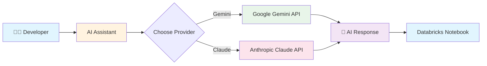

---

## Architecture

### High-Level Architecture

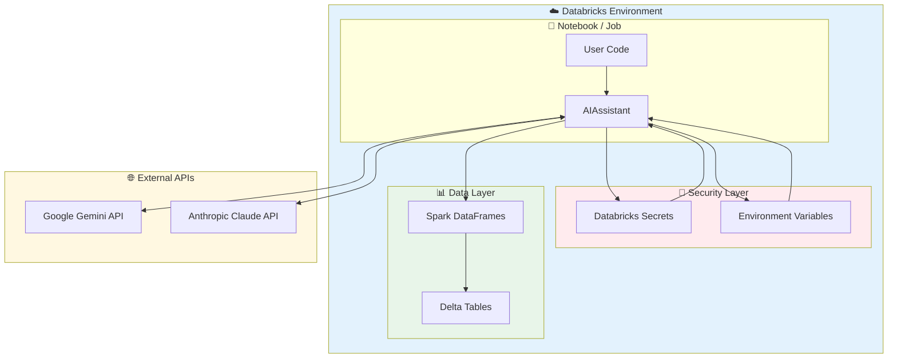

### Component Architecture

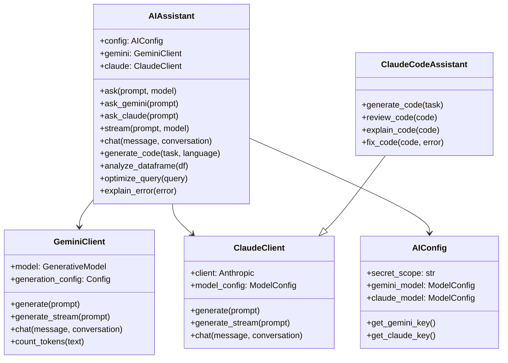

### Request Flow

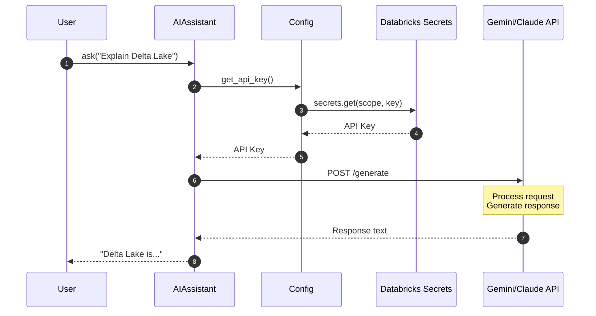

---

## Features

### Feature Overview

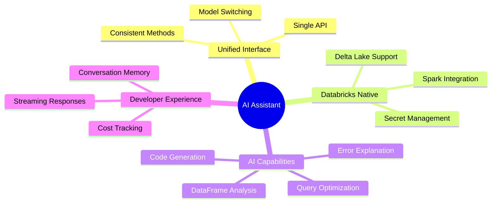

### Detailed Features

| Feature | Description | Gemini | Claude |
|---------|-------------|:------:|:------:|
| **Text Generation** | Generate responses to prompts | ✅ | ✅ |
| **Streaming** | Real-time response streaming | ✅ | ✅ |
| **Conversations** | Multi-turn chat with memory | ✅ | ✅ |
| **Code Generation** | Generate code for specific tasks | ✅ | ✅ |
| **Code Review** | Review and improve code | ✅ | ✅ |
| **Code Explanation** | Explain complex code | ✅ | ✅ |
| **Error Analysis** | Debug errors with context | ✅ | ✅ |
| **DataFrame Analysis** | AI-powered data insights | ✅ | ✅ |
| **Query Optimization** | SQL optimization suggestions | ✅ | ✅ |
| **Batch Processing** | Process data at scale with UDFs | ✅ | ✅ |
| **Cost Tracking** | Monitor token usage and costs | ✅ | ✅ |

---

## Installation

### Installation Flow

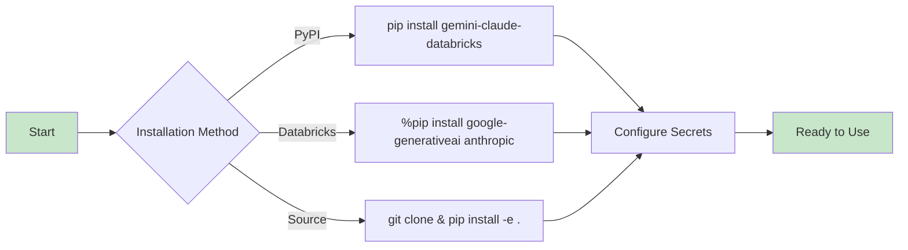

### Option 1: Install from PyPI (when published)
```python
%pip install gemini-claude-databricks
```

### Option 2: Install directly in Databricks notebook
```python
%pip install google-generativeai anthropic

# Copy the ai_assistant module to your workspace or DBFS
```

### Option 3: Clone and install locally
```bash
git clone https://github.com/gustcol/gemini-claude-databricks.git
cd gemini-claude-databricks
pip install -e .
```

### Dependencies

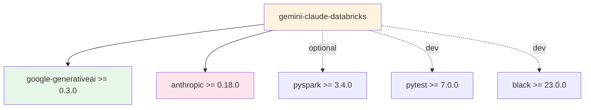

---

## Quick Start

### Setup Process

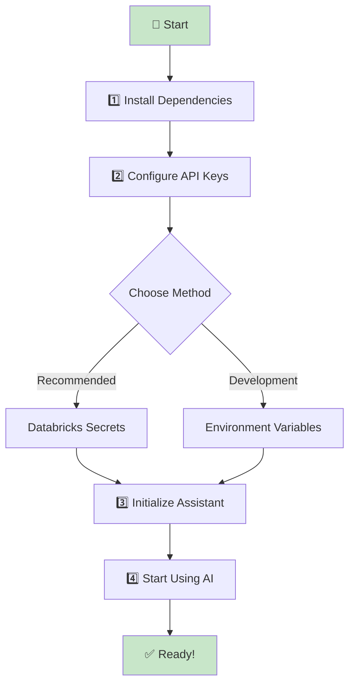

### Step 1: Configure Secrets in Databricks

```bash
# Using Databricks CLI
databricks secrets create-scope --scope ai-keys

# Add your API keys
databricks secrets put --scope ai-keys --key gemini-api-key
databricks secrets put --scope ai-keys --key claude-api-key
```

### Step 2: Initialize and Use

```python
from ai_assistant import AIAssistant

# Initialize with Databricks secret scope
assistant = AIAssistant(
    secret_scope="ai-keys",
    gemini_secret_key="gemini-api-key",
    claude_secret_key="claude-api-key"
)

# Use Gemini
response = assistant.ask_gemini("Explain PySpark DataFrame operations")
print(response)

# Use Claude
response = assistant.ask_claude("Write a function to optimize Spark queries")
print(response)

# Use default model (Claude)
response = assistant.ask("What is Delta Lake?")
print(response)
```

---

## Configuration

### Configuration Hierarchy

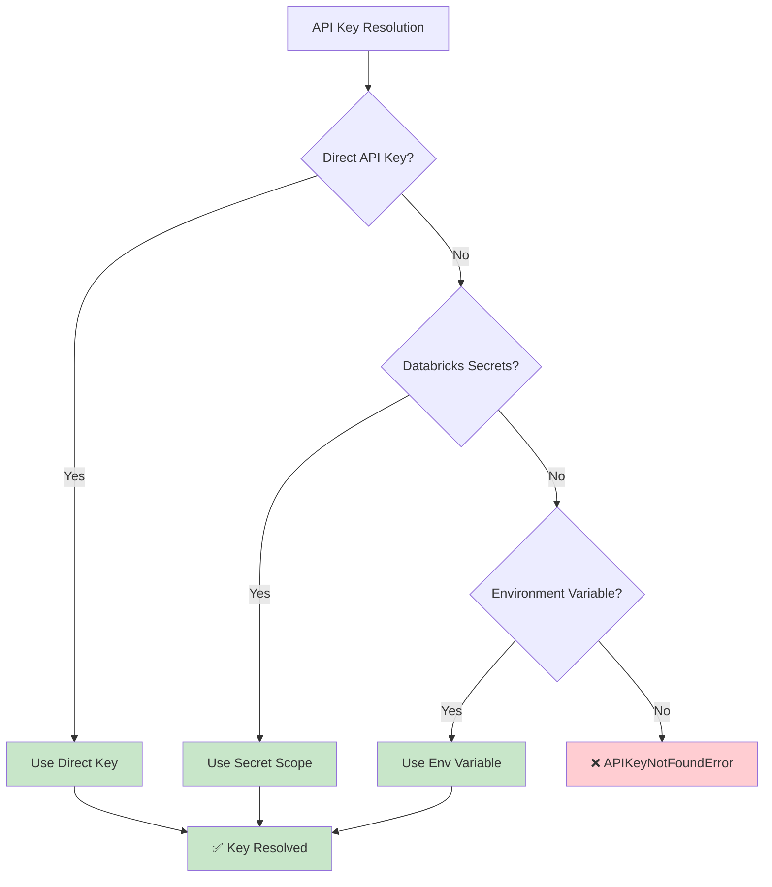

### Configuration Options

```python
from ai_assistant import AIAssistant

assistant = AIAssistant(
    # Secret Management
    secret_scope="ai-keys",           # Databricks secret scope name
    gemini_secret_key="gemini-key",   # Key name in secret scope
    claude_secret_key="claude-key",   # Key name in secret scope

    # Model Selection
    gemini_model="gemini-1.5-pro",    # Gemini model to use
    claude_model="claude-sonnet-4-20250514",  # Claude model to use

    # Generation Parameters
    max_tokens=4096,                  # Maximum output tokens
    temperature=0.7,                  # Creativity (0.0 - 1.0)
)
```

### Environment Variables (Alternative)

```python
import os
os.environ["GEMINI_API_KEY"] = "your-gemini-key"
os.environ["ANTHROPIC_API_KEY"] = "your-claude-key"

assistant = AIAssistant()  # Auto-detects from environment
```

### Supported Models

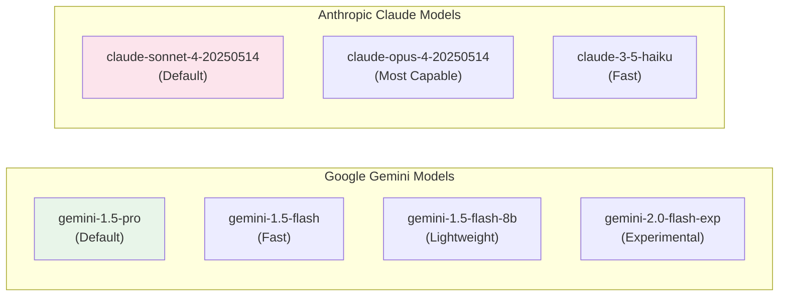

---

## Core Components

### Module Structure

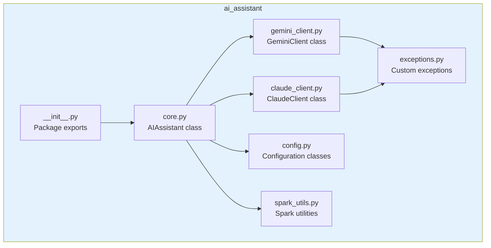

### Class Relationships

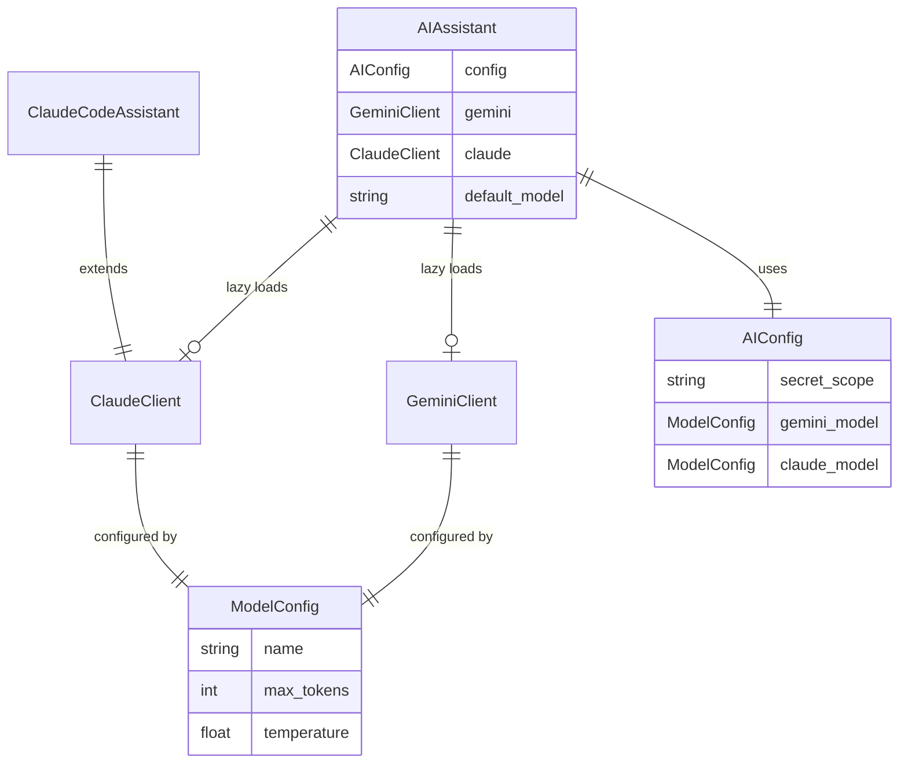

---

## Usage Examples

### Basic Conversation Flow

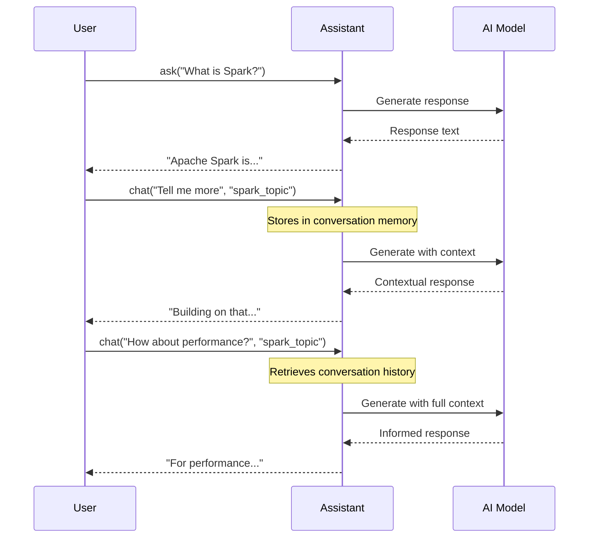

### Code Generation Example

```python
# Generate PySpark code
code = assistant.generate_code(
    task="Create a function that reads a Delta table and performs aggregations",
    language="python",
    context="Using Databricks with Unity Catalog",
    include_tests=True
)
print(code)
```

### DataFrame Analysis

```python
# Load a DataFrame
df = spark.read.table("sales.transactions")

# Get AI-powered analysis
analysis = assistant.analyze_dataframe(
    df,
    questions=[
        "What are the data quality issues?",
        "Suggest optimization strategies",
        "Recommend partitioning scheme"
    ]
)
print(analysis)
```

### Query Optimization

```python
slow_query = """
SELECT customer_id, SUM(amount) as total
FROM orders
JOIN customers ON orders.customer_id = customers.id
WHERE order_date >= '2024-01-01'
GROUP BY customer_id
"""

optimized = assistant.optimize_query(
    query=slow_query,
    context="orders: 500M rows, customers: 10M rows"
)
print(optimized)
```

### Error Debugging

```python
error_message = """
AnalysisException: Table or view not found: sales.transactions
"""

explanation = assistant.explain_error(
    error_message=error_message,
    code="df = spark.read.table('sales.transactions')"
)
print(explanation)
```

---

## Spark Integration

### Batch Processing Architecture

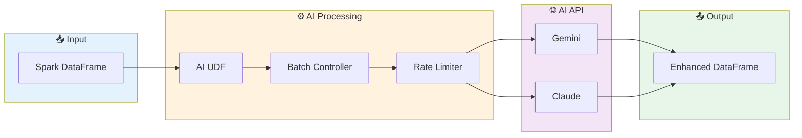

### Process DataFrame with AI

```python
from ai_assistant.spark_utils import process_with_ai

# Process text column with AI
results_df = process_with_ai(
    spark_df=input_df,
    prompt_column="product_description",
    model="gemini",
    output_column="ai_analysis",
    batch_size=10,
    rate_limit_delay=0.5,
    system_instruction="Analyze sentiment and extract key features"
)

results_df.show()
```

### Create Custom AI UDF

```python
from ai_assistant.spark_utils import create_ai_udf
from pyspark.sql.functions import col

# Create a sentiment analysis UDF
sentiment_udf = create_ai_udf(
    model="claude",
    api_key=api_key,
    system_instruction="Classify sentiment as: positive, negative, or neutral",
    max_tokens=50
)

# Apply to DataFrame
df_with_sentiment = df.withColumn(
    "sentiment",
    sentiment_udf(col("review_text"))
)
```

### Cost Estimation

```python
from ai_assistant.spark_utils import estimate_processing_cost

# Estimate before processing
estimate = estimate_processing_cost(
    row_count=100000,
    avg_input_tokens=150,
    avg_output_tokens=100,
    model="gemini-1.5-flash"
)

print(f"Estimated cost: ${estimate['total_cost']:.2f}")
print(f"Total tokens: {estimate['total_input_tokens'] + estimate['total_output_tokens']:,}")
```

---

## API Reference

### Core Methods

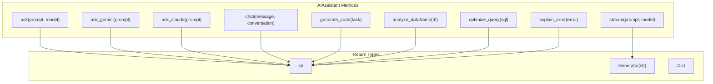

### Method Signatures

| Method | Parameters | Returns | Description |
|--------|------------|---------|-------------|
| `ask()` | `prompt: str, model: str = None` | `str` | Ask any model |
| `ask_gemini()` | `prompt: str, system_instruction: str = None` | `str` | Ask Gemini |
| `ask_claude()` | `prompt: str, system_instruction: str = None` | `str` | Ask Claude |
| `stream()` | `prompt: str, model: str = None` | `Generator` | Stream response |
| `chat()` | `message: str, conversation_name: str` | `str` | Multi-turn chat |
| `generate_code()` | `task: str, language: str = "python"` | `str` | Generate code |
| `analyze_dataframe()` | `df: DataFrame, questions: List[str]` | `str` | Analyze data |
| `optimize_query()` | `query: str, context: str = None` | `str` | Optimize SQL |
| `explain_error()` | `error_message: str, code: str = None` | `str` | Debug errors |

See [API Documentation](docs/api.md) for complete reference.

---

## Security Best Practices

### Security Flow

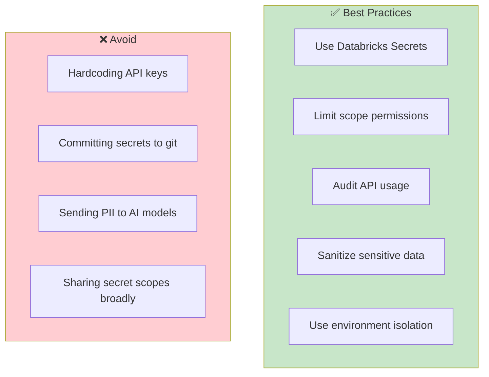

### Security Checklist

- [ ] **Never hardcode API keys** - Always use Databricks Secrets or environment variables
- [ ] **Limit secret scope access** - Grant minimal permissions to secret scopes
- [ ] **Audit usage** - Monitor API calls and costs regularly
- [ ] **Data privacy** - Be mindful of sensitive data sent to AI models
- [ ] **Use service principals** - For production workloads
- [ ] **Rotate keys regularly** - Update API keys periodically

---

## Troubleshooting

### Error Resolution Flow

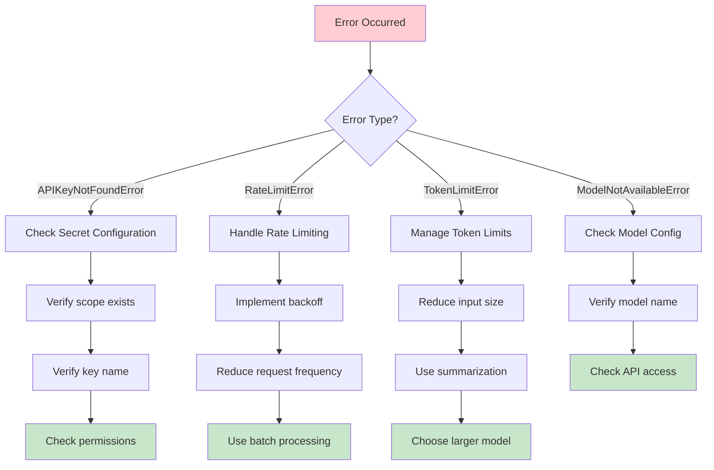

### Common Issues

| Issue | Cause | Solution |
|-------|-------|----------|
| `APIKeyNotFoundError` | API key not configured | Configure secrets or environment variables |
| `RateLimitError` | Too many requests | Implement exponential backoff |
| `TokenLimitError` | Input/output too large | Reduce text size or use larger model |
| `ModelNotAvailableError` | Invalid model name | Check supported models list |
| `DatabricksContextError` | Not in Databricks env | Use environment variables instead |

---

## Project Structure

```
gemini-claude-databricks/
├── 📁 ai_assistant/
│   ├── 📄 __init__.py          # Package exports
│   ├── 📄 core.py              # Main AIAssistant class
│   ├── 📄 gemini_client.py     # Google Gemini client
│   ├── 📄 claude_client.py     # Anthropic Claude client
│   ├── 📄 config.py            # Configuration management
│   ├── 📄 exceptions.py        # Custom exceptions
│   └── 📄 spark_utils.py       # Spark integration
├── 📁 examples/
│   ├── 📄 01_basic_usage.py    # Basic examples
│   └── 📄 02_code_generation.py # Code generation
├── 📁 notebooks/
│   └── 📄 AI_Assistant_Quickstart.py  # Databricks notebook
├── 📁 docs/
│   └── 📄 api.md               # API documentation
├── 📁 tests/
│   └── 📄 test_ai_assistant.py # Unit tests
├── 📄 README.md                # This file
├── 📄 requirements.txt         # Dependencies
├── 📄 setup.py                 # Package setup
└── 📄 .gitignore              # Git ignore rules
```

---

## Token Pricing Reference

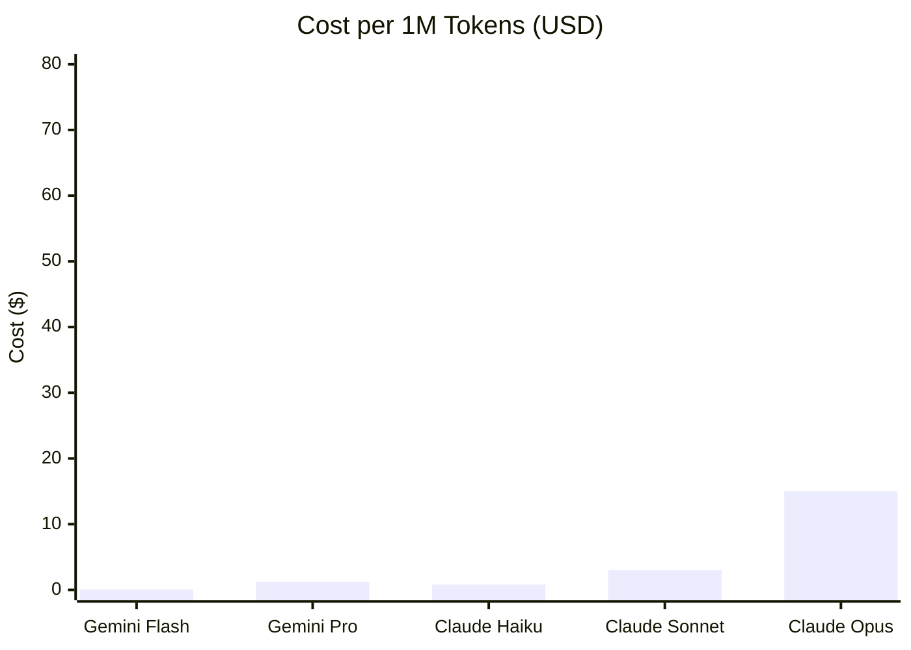

| Model | Input (per 1K) | Output (per 1K) | Best For |
|-------|----------------|-----------------|----------|
| Gemini 1.5 Flash | $0.000075 | $0.0003 | High-volume, simple tasks |
| Gemini 1.5 Pro | $0.00125 | $0.005 | Complex reasoning |
| Claude Haiku | $0.0008 | $0.004 | Fast, cost-effective |
| Claude Sonnet | $0.003 | $0.015 | Balanced performance |
| Claude Opus | $0.015 | $0.075 | Maximum capability |

---

## Pipeline Generation

The library includes powerful AI-driven pipeline generation capabilities for creating DLT pipelines, ETL workflows, and medallion architectures.

### Pipeline Architecture

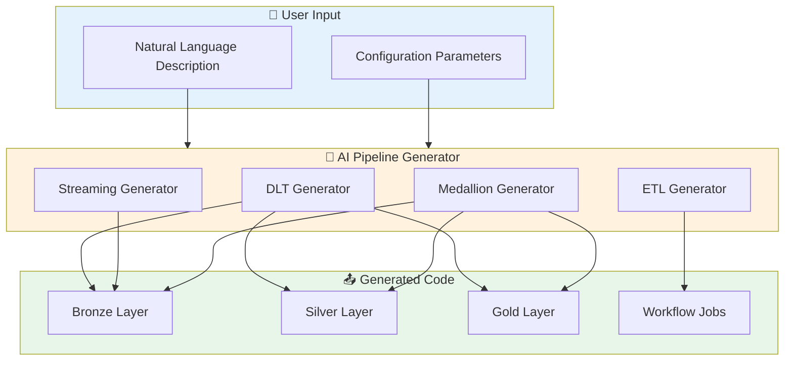

### Generate Delta Live Tables Pipeline

```python
from ai_assistant import AIAssistant
from ai_assistant.pipelines import PipelineGenerator

assistant = AIAssistant(secret_scope="ai-keys")
generator = PipelineGenerator(assistant)

# Generate a complete DLT pipeline
dlt_code = generator.generate_dlt_pipeline(
    description="Process customer orders with data quality validation",
    source_table="bronze.raw_orders",
    target_catalog="analytics",
    target_schema="gold",
    include_expectations=True,
    include_streaming=True
)

print(dlt_code)
```

### Generate Medallion Architecture

```python
# Generate complete medallion architecture
medallion_code = generator.generate_medallion_architecture(
    description="E-commerce sales data pipeline with customer analytics",
    source_path="/mnt/landing/sales/",
    source_format="json",
    catalog="ecommerce",
    include_dlt=True
)

print(medallion_code)
```

### Generate ETL Pipeline

```python
# Generate traditional ETL pipeline
etl_code = generator.generate_etl_pipeline(
    description="Daily customer data synchronization",
    source_config={
        "path": "/data/customers",
        "format": "parquet"
    },
    target_config={
        "catalog": "prod",
        "schema": "dimensions",
        "table": "dim_customer"
    },
    transformations=["deduplicate", "validate_email", "standardize_phone"]
)

print(etl_code)
```

### Generate Streaming Pipeline

```python
# Generate Structured Streaming pipeline
streaming_code = generator.generate_streaming_pipeline(
    description="Real-time clickstream processing",
    source_config={
        "format": "kafka",
        "topic": "user_clicks",
        "bootstrap_servers": "kafka:9092"
    },
    target_config={
        "catalog": "realtime",
        "schema": "events",
        "table": "click_events"
    },
    watermark_column="event_time",
    watermark_delay="10 minutes"
)

print(streaming_code)
```

### Generate Databricks Workflow

```python
# Generate workflow/job definition
workflow = generator.generate_workflow(
    description="Daily ETL pipeline with data validation and alerting",
    schedule="0 0 6 * * ?",  # Daily at 6 AM
    tasks=[
        {"name": "extract", "notebook": "/ETL/extract"},
        {"name": "transform", "notebook": "/ETL/transform", "depends_on": ["extract"]},
        {"name": "validate", "notebook": "/ETL/validate", "depends_on": ["transform"]},
        {"name": "load", "notebook": "/ETL/load", "depends_on": ["validate"]}
    ]
)

print(workflow)
```

### Analyze Existing Pipeline

```python
# Analyze and get recommendations
analysis = generator.analyze_pipeline(existing_code)
print(analysis)

# Convert between formats
dlt_code = generator.convert_pipeline(
    spark_code,
    source_format="spark",
    target_format="dlt"
)
```

---

## Unity Catalog Integration

Full support for Unity Catalog operations including schema generation, governance, and data lineage.

### Unity Catalog Architecture

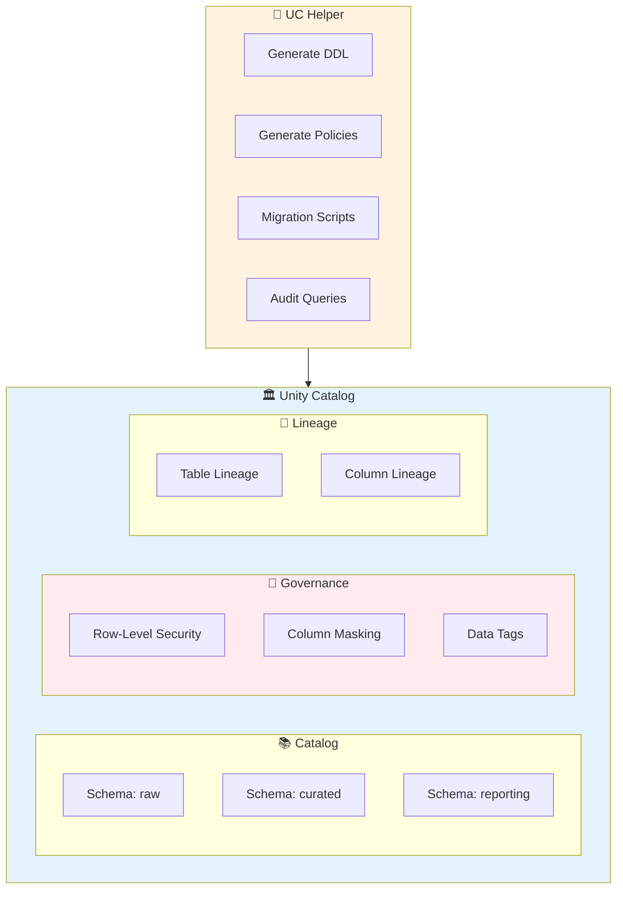

### Generate Table DDL

```python
from ai_assistant import AIAssistant
from ai_assistant.unity_catalog import UnityCatalogHelper

assistant = AIAssistant(secret_scope="ai-keys")
uc_helper = UnityCatalogHelper(assistant)

# Generate table DDL from description
ddl = uc_helper.generate_table_ddl(
    description="Customer master data table with PII fields including email, phone, and address",
    catalog="enterprise",
    schema="master_data",
    table_name="dim_customer",
    include_governance=True
)

print(ddl)
```

### Generate Complete Schema

```python
# Generate entire schema with multiple tables
schema_ddl = uc_helper.generate_schema_ddl(
    description="E-commerce data domain for order processing",
    catalog="ecommerce",
    schema_name="orders",
    tables=["customers", "orders", "order_items", "products", "payments"]
)

print(schema_ddl)
```

### Row-Level Security

```python
# Generate row-level security policy
rls_policy = uc_helper.generate_row_level_security(
    table="sales.transactions.orders",
    description="Sales reps can only see orders from their assigned region. Managers see all regions."
)

print(rls_policy)
```

### Column Masking

```python
# Generate column masking for PII
mask = uc_helper.generate_column_mask(
    table="hr.employees.personal_info",
    column="ssn",
    description="Mask SSN showing only last 4 digits. HR team sees full SSN."
)

print(mask)
```

### Access Policies

```python
from ai_assistant.unity_catalog import SecurableType

# Generate access control statements
grants = uc_helper.generate_access_policy(
    description="Data scientists need SELECT access, Data engineers need ALL PRIVILEGES",
    securable="analytics.sales.transactions",
    securable_type=SecurableType.TABLE
)

print(grants)
```

### Data Lineage Exploration

```python
# Generate lineage queries
lineage_queries = uc_helper.generate_data_lineage_query(
    table="gold.sales.daily_metrics",
    direction="upstream"  # or "downstream" or "both"
)

print(lineage_queries)
```

### Audit Log Analysis

```python
# Generate audit queries
audit_queries = uc_helper.generate_audit_queries(
    catalog="production",
    event_type="TABLE_ACCESS",
    time_range="30 days"
)

print(audit_queries)
```

### Table Migration to Unity Catalog

```python
# Generate migration script from Hive metastore
migration_script = uc_helper.migrate_table_to_uc(
    source_table="hive_metastore.legacy.customers",
    target_catalog="enterprise",
    target_schema="master_data",
    include_data=True
)

print(migration_script)
```

### Table Analysis

```python
# Analyze table and get recommendations
analysis = uc_helper.analyze_table("prod.sales.transactions")
print(analysis)
```

### Best Practices

```python
from ai_assistant.unity_catalog import get_uc_best_practices

# Get Unity Catalog best practices guide
best_practices = get_uc_best_practices()
print(best_practices)
```

---

## Contributing

Contributions are welcome! Please follow these steps:

```mermaid
gitGraph
    commit id: "Fork repo"
    branch feature
    commit id: "Create branch"
    commit id: "Make changes"
    commit id: "Add tests"
    commit id: "Update docs"
    checkout main
    merge feature id: "Create PR"
    commit id: "Review & merge"
```

1. Fork the repository
2. Create a feature branch (`git checkout -b feature/amazing-feature`)
3. Make your changes
4. Add tests for new functionality
5. Update documentation
6. Submit a Pull Request

---

## License

MIT License - see [LICENSE](LICENSE) for details.

---

## Acknowledgments

- [Google Generative AI](https://ai.google.dev/) for Gemini API
- [Anthropic](https://www.anthropic.com/) for Claude API
- [Databricks](https://databricks.com/) for the amazing platform

---

## Author

**Guxxxta / Gustcol**
- Email: gustcol@gmail.com
- GitHub: [@gustcol](https://github.com/gustcol)

---

<p align="center">
  Made with ❤️ for the Databricks community
</p>
